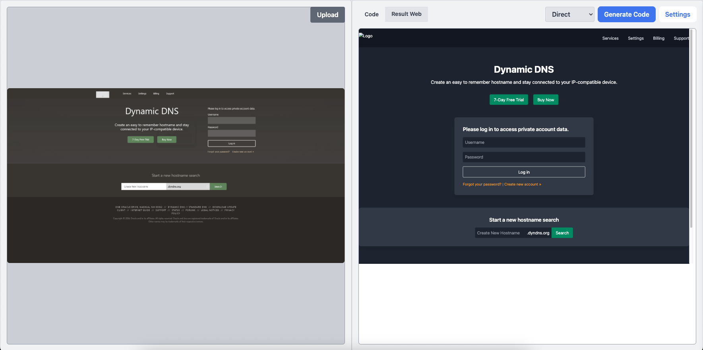
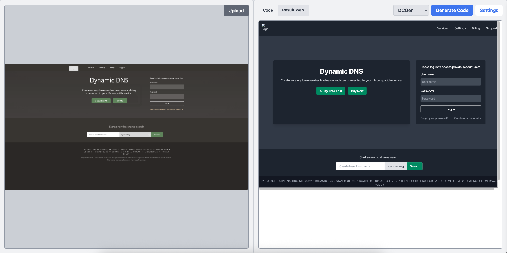
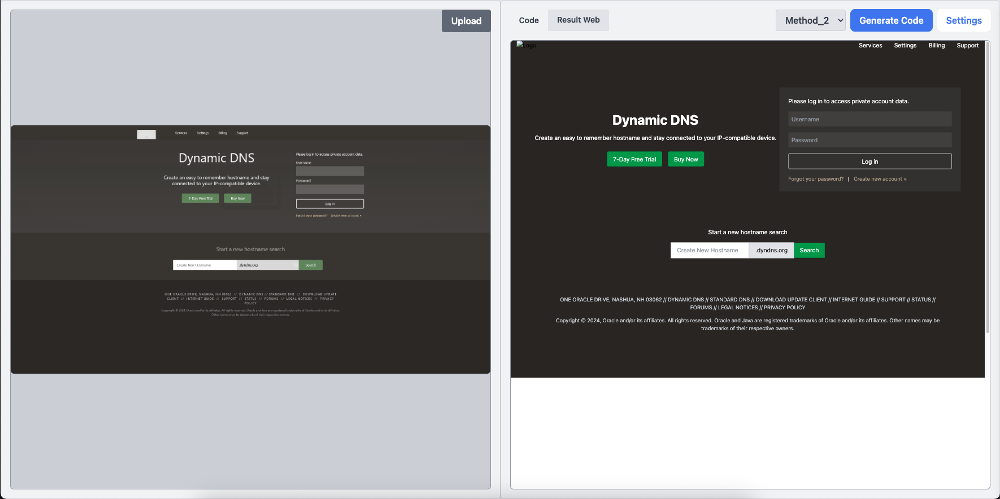

# Towards Improving UI Code Generation for Screenshot to Code

## Abstract

User Interface (UI) screenshot-to-code generation has tremendous potential in accelerating
frontend software development; however, current methods to automate this task are very fragile
and cannot be directly used in the real world. Our proposed approach is an end-to-end automatic
pipeline for UI screenshot-to-code generation, which extends DCGen, by integrating a data-driven
segmentation-aware strategy, thereby replacing the heuristic-based division strategy. This
therefore offers more robust and principled decomposition of the UI components, which enables
scaling to more complex web designs. Our proposed approach shows substantial improvements in
fine-grained evaluation metrics, achieving gains exceeding 8%, 7%, and 10% in block matching,
positional accuracy, and text similarity, respectively, relative to DCGen. These results indicate that the proposed method more closely reproduces the visual elements present in the target screenshot. Furthermore, we explored reducing the cost of the segmentation approach by using a UI layout element tree which acts as an intermediate representation of the UI.

---

## Sample Results

The figures below compare the output of three methods on the same input screenshot.

**Direct (single-call baseline)**



**DCGen**



**Method 2 (Ours)**



---

## Method 2 Pipeline

The figure shows the method overview for Method 2


---

## Setup

```shell
pip install -r requirements.txt
playwright install
```

Install the metric toolkit dependencies:

```shell
cd scripts
bash install.sh
```

Place your OpenAI API key in `keys/key.txt`.


---

## Datasets
The evaluation dataset used in this work is sourced from the original DCGen paper (see [Acknowledgements](#acknowledgements)).
The full dataset is available on [HuggingFace](https://huggingface.co/datasets/iforgott/DCGen).

This repository includes a sample of **111 evaluation cases** in `data/111_eval_data/`, which is the subset used in our experiments.
Each entry contains the reference HTML file and its corresponding screenshot (`.png`).

---

## Running Experiments

### Generate HTML from screenshots

Edit the paths at the top of `scripts/run_experiment.py`, then run:

```shell
cd scripts
python run_experiment.py
```

This runs the full pipeline:
1. Generates HTML for all images in `IMG_DIR`
2. Takes screenshots of all generated HTMLs
3. Flattens outputs into `generated_htmls/` and `generated_pngs/`
4. Computes CLIP, code similarity, and Design2Code fine-grained metrics
5. Writes a summary to `summary.txt`

### Run Design2Code evaluation only (offline)

If Steps 1–3 are already complete, you can re-run evaluation independently:

```shell
cd scripts
python run_d2c_eval.py
```

Update `RESULTS_DIR` and `IMG_DIR` at the top of `run_d2c_eval.py` before running.

---

## Interactive Tool

Run the web-based interface locally to generate code from a single uploaded screenshot:

```shell
cd Tool
python app.py
```

Visit [http://127.0.0.1:8080](http://127.0.0.1:8080) in your browser.

Three generation methods are available from the dropdown:

- **Direct** — sends the full screenshot to the model in a single call
- **DCGen** — heuristic divide-and-conquer segmentation
- **Method_2** — YOLO-based data-driven segmentation (ours)

---

## Evaluation

Modify the configurations in `scripts/evaluate.py`:

```python
original_reference_dir = "../data/111_eval_data"
test_dirs = {
    "method2": "../data/your_output_dir",
}
exp_name = "../results/exp_name"
```

Then run:

```shell
cd scripts
python evaluate.py
```

> Fine-grained Design2Code metrics can only be run on Linux or macOS.

---

## Acknowledgements

This project builds upon **DCGen**:

> GitHub: [https://github.com/WebPAI/DCGen](https://github.com/WebPAI/DCGen)

```bibtex
@article{wan2024automatically,
  title={Automatically generating ui code from screenshot: A divide-and-conquer-based approach},
  author={Wan, Yuxuan and Wang, Chaozheng and Dong, Yi and Wang, Wenxuan and Li, Shuqing
          and Huo, Yintong and Lyu, Michael R},
  journal={arXiv preprint arXiv:2406.16386},
  year={2024}
}
```